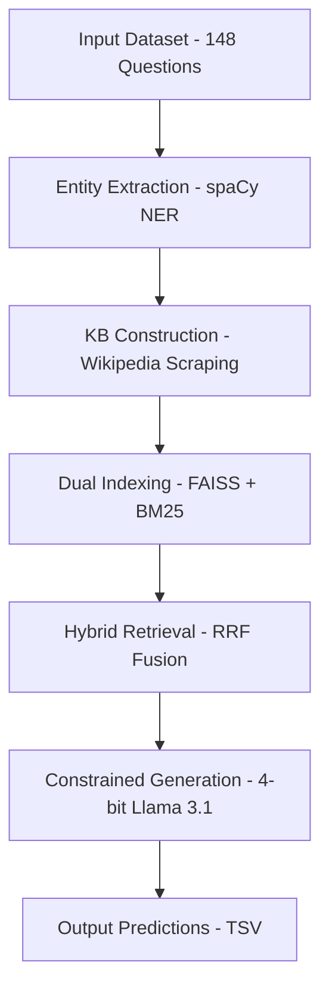

# BLEnD CultureRAG Architecture

## System Overview

The **BLEnD CultureRAG** system is a Retrieval-Augmented Generation (RAG) pipeline designed for multi-cultural multiple-choice question answering. It combines entity extraction, automated Wikipedia knowledge retrieval, hybrid search, and deterministic language model generation.

## High-Level Architecture



## Core Components

### 1. Entity Extraction Layer
**Technology:** spaCy `en_core_web_sm`
**Functionality:**
- Identified Entities: `GPE`, `LOC`, `PERSON`, `ORG`, `EVENT`, `WORK_OF_ART`.
- **Acronym Fallback:** Captures all-caps entities (e.g., "HDB", "UK") via regex.
- **Contextual Filtering:** Removes question-specific words and common stopwords.

### 2. Knowledge Base Construction
**Strategy:** Two-Tier Wikipedia Retrieval
1.  **Tier 1 (Base):** Broad country culture pages (e.g., "Culture of Singapore").
2.  **Tier 2 (Entity):** Specific pages for top-ranked entities in each question.

**Quality Metrics:**
- Minimum 100 characters per paragraph.
- Citation noise filtering (max 5 brackets).
- Persistent disk caching (`wiki_cache.pkl`).

### 3. Dual Indexing System
- **FAISS (Dense):** Uses `all-MiniLM-L6-v2` embeddings for semantic similarity.
- **BM25 (Sparse):** Uses `BM25Okapi` for lexical (keyword) accuracy.

### 4. Hybrid Retrieval (RRF)
Implemented via **Reciprocal Rank Fusion**:
```
score = 1/(k + rank_BM25) + 1/(k + rank_FAISS)
```
- **Constraint:** Pre-filters KB chunks by country code.
- **Robustness:** Falls back to full KB if local coverage is insufficient (<3 chunks).

### 5. Constrained Generation (1-Token Decoder)
**Model:** `meta-llama/Llama-3.1-8B-Instruct`
**Quantization:** **4-bit NF4** (via `bitsandbytes`) for efficiency.
**Logic:**
- `max_new_tokens=1`: Guarantees exactly one letter output (A/B/C/D).
- `do_sample=False`: Ensures 100% deterministic results.
- **Safety Fallback:** Defaults to 'C' on model failure.

---

## Performance Characteristics

| Metric | Target |
|--------|--------|
| **Retrieval Latency** | ~50ms |
| **Generation Latency** | ~200ms |
| **Total Questions** | 148 |
| **VRAM Usage** | ~6.5 GB (4-bit) |

## Robustness Features

1.  **Disk Caching:** Prevents redundant Wikipedia API calls.
2.  **Checkpointing:** Resume-from-crash inference loop.
3.  **Country Fallback:** Dynamic retrieval scope based on data availability.
4.  **1-Token Parsing:** Eliminates regex brittleness in decoding.
